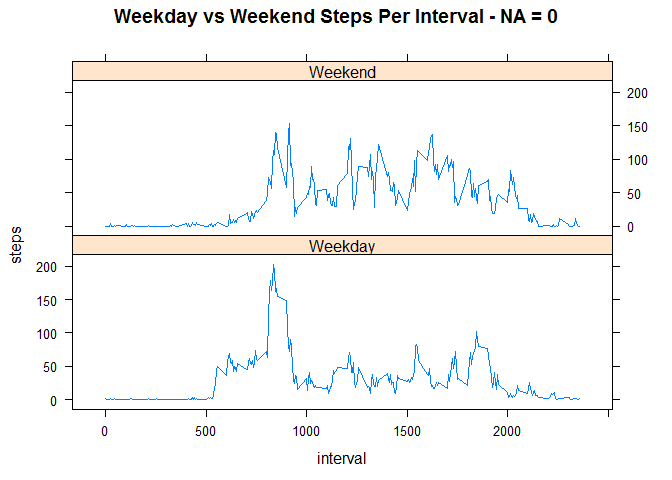
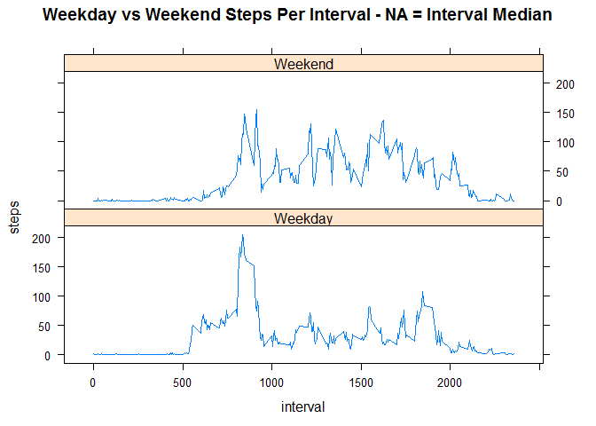

# Reproducible Research: Peer Assessment 1


## Loading and preprocessing the data

Set echo = TRUE, just in case someone changed defaults.
Require knitr to avoid errors.

```r
require(knitr)
opts_chunk$set(echo = TRUE)
```

1. *Load the data (i.e. read.csv())*

Assumes zip file is in the same directory and file is already tidy.


```r
mydt <- read.csv(unzip("activity.zip"),header=TRUE,sep=",",colClasses=c("numeric","Date","numeric"),na.strings="NA")
```

2. *Process/transform the data (if necessary) into a format suitable for your analysis*


```r
mydt_nona <- na.omit(mydt) 
```


## What is mean total number of steps taken per day?


```r
steps_per_day <- aggregate(steps ~ date, data = mydt_nona, sum)
```

1. *Make a histogram of the total number of steps taken each day*

I changed the scale of the steps so it's easier to read.

Note: If you'd like more gradation, you can use add breaks (ie `breaks=22`), but to follow the assignment instructions I left the default histogram settings.


```r
hist(steps_per_day$steps/1000, 
     col = "red", 
     xlab = "Total Steps Per Day (Thousands)", 
     main = "Histogram of Total Steps Per Day", 
     cex.main=0.9, 
     cex.lab=0.9, 
     cex.axis=0.9)
```

 


2. *Calculate and report the mean and median total number of steps taken per day*

(summary() includes mean and median as well as other values.)


```r
summary(steps_per_day$steps)
```

```
##    Min. 1st Qu.  Median    Mean 3rd Qu.    Max. 
##      41    8841   10760   10770   13290   21190
```


## What is the average daily activity pattern?

Note: the minute intervals are actually not continuous. 

As 12:55am becomes 1:00, the interval jumps from 55 to 100. [Class Forum Link](https://class.coursera.org/repdata-016/forum/thread?thread_id=8)

To make it a cleaner plot, I used the following formula:

  total minutes = hours\*60 + non-hour interval minutes = hours\*60 + interval%%100


```r
zzz <- aggregate(steps ~ interval, data = mydt_nona, mean)
ave_steps_per_interval <- cbind(zzz, minutes = 60*floor(zzz$interval/100)+zzz$interval%%100)
```

1. *Make a time series plot (i.e. type = "l") of the 5-minute interval (x-axis) and the average number of steps taken, averaged across all days (y-axis)*


```r
plot(x=ave_steps_per_interval$minutes/60, 
     y=ave_steps_per_interval$steps, 
     type="l",
     xlab = "Intervals (Hour)", 
     ylab = "Steps (Ave)",
     main = "Average Number of Steps per Interval", 
     cex.main=0.9, 
     cex.lab=0.9, 
     cex.axis=0.9)
```

 

2. *Which 5-minute interval, on average across all the days in the dataset, contains the maximum number of steps?*


```r
head(ave_steps_per_interval[order(ave_steps_per_interval$steps,decreasing = TRUE),],11)
```

```
##     interval    steps minutes
## 104      835 206.1698     515
## 105      840 195.9245     520
## 107      850 183.3962     530
## 106      845 179.5660     525
## 103      830 177.3019     510
## 101      820 171.1509     500
## 108      855 167.0189     535
## 100      815 157.5283     495
## 102      825 155.3962     505
## 109      900 143.4528     540
## 99       810 129.4340     490
```

The most steps occur at 8:35 in the morning. 

Furthermore, the next 10 runners up are all within 30 minutes of 8:35.


## Imputing missing values

*Note that there are a number of days/intervals where there are missing values (coded as NA). The presence of missing days may introduce bias into some calculations or summaries of the data.*

1. *Calculate and report the total number of missing values in the dataset (i.e. the total number of rows with NAs)*

There are several ways to get this. The simplest is to just use `summary()` to get the number of NA's and the `str()` to get the total number of rows.

```r
summary(mydt)
```

```
##      steps             date               interval     
##  Min.   :  0.00   Min.   :2012-10-01   Min.   :   0.0  
##  1st Qu.:  0.00   1st Qu.:2012-10-16   1st Qu.: 588.8  
##  Median :  0.00   Median :2012-10-31   Median :1177.5  
##  Mean   : 37.38   Mean   :2012-10-31   Mean   :1177.5  
##  3rd Qu.: 12.00   3rd Qu.:2012-11-15   3rd Qu.:1766.2  
##  Max.   :806.00   Max.   :2012-11-30   Max.   :2355.0  
##  NA's   :2304
```

```r
str(mydt)
```

```
## 'data.frame':	17568 obs. of  3 variables:
##  $ steps   : num  NA NA NA NA NA NA NA NA NA NA ...
##  $ date    : Date, format: "2012-10-01" "2012-10-01" ...
##  $ interval: num  0 5 10 15 20 25 30 35 40 45 ...
```

A more precise way to do it would be

```r
num_na <- sum(is.na(mydt$steps))
total_rows <- nrow(mydt)
portion_nas <- num_na/total_rows
num_na
```

```
## [1] 2304
```

```r
total_rows
```

```
## [1] 17568
```

```r
portion_nas
```

```
## [1] 0.1311475
```


2. *Devise a strategy for filling in all of the missing values in the dataset. The strategy does not need to be sophisticated. For example, you could use the mean/median for that day, or the mean for that 5-minute interval, etc.*

Let's try a few strategies:

* fill in NA's with 0's


```r
mydt_0 <- mydt
mydt_0[is.na(mydt_0)]<-0
```

* fill in NA's with mean for that day of the week (median gives all 0's)


```r
mean_steps_per_day <- aggregate(steps ~ weekdays(date), data = mydt_nona, mean)
names(mean_steps_per_day) <- c("weekday","steps")
mydt_meanday <- cbind(mydt, weekday=weekdays(mydt$date))

zzz <- merge(mydt_meanday, mean_steps_per_day, by.x = "weekday", by.y = "weekday", all = TRUE)
zzz <- cbind(zzz, steps = ifelse(is.na(zzz$steps.x), zzz$steps.y, zzz$steps.x))
mydt_meanday <- subset(zzz,select = c(steps, date, interval))
```

* fill in NA's with median for the interval


```r
median_steps_per_interval <- aggregate(steps ~ interval, data = mydt_nona, median)
zzz <- merge(mydt, median_steps_per_interval, by.x = "interval", by.y = "interval", all = TRUE)
zzz <- cbind(zzz, steps = ifelse(is.na(zzz$steps.x), zzz$steps.y, zzz$steps.x))
mydt_medint <- subset(zzz,select = c(steps, date, interval))
```

* fill in NA's with mean for the interval

```r
mean_steps_per_interval <- aggregate(steps ~ interval, data = mydt_nona, mean)
zzz <- merge(mydt, mean_steps_per_interval, by.x = "interval", by.y = "interval", all = TRUE)
zzz <- cbind(zzz, steps = ifelse(is.na(zzz$steps.x), zzz$steps.y, zzz$steps.x))
mydt_meanint <- subset(zzz,select = c(steps, date, interval))
```
3. *Create a new dataset that is equal to the original dataset but with the missing data filled in.*

I've made 4: `mydt_0`, `mydt_meanday`, `mydt_medint`, `mydt_meanint`

4. *Make a histogram of the total number of steps taken each day and Calculate and report the mean and median total number of steps taken per day.*


```r
layout(matrix(c(1,1,2,3,4,5), nrow=3, ncol=2, byrow = TRUE), heights=c(0.4,1,1))

par(mar=c(0,4,3,2)+0.1)
## plot.new()
plot(1, type="n", main="Histograms of Total Steps Per Day", axes=FALSE , xlab="", ylab="")
## plot(1, type = "n", axes=FALSE, xlab="", ylab="", main="")
legend(x="top", inset=0, lty = 1, col = c("blue", "red"), 
       legend = c("NA's Replaced", "Original Data"), horiz=TRUE)

par(mar=c(5,4,4,2)+0.1)

hist(aggregate(steps ~ date, data = mydt_0, sum)$steps/1000, 
     col = "blue", 
     xlab = "Total Steps Per Day (Thousands)", 
     main = "NA's = 0")

hist(aggregate(steps ~ date, data = mydt_nona, sum)$steps/1000, 
     col = "red",
     add=T)

hist(aggregate(steps ~ date, data = mydt_meanday, sum)$steps/1000, 
     col = "blue", 
     xlab = "Total Steps Per Day (Thousands)", 
     main = "NA's = Daily Mean")

hist(aggregate(steps ~ date, data = mydt_nona, sum)$steps/1000, 
     col = "red",
     add=T)

hist(aggregate(steps ~ date, data = mydt_medint, sum)$steps/1000, 
     col = "blue", 
     xlab = "Total Steps Per Day (Thousands)", 
     main = "NA's = Interval's Median")

hist(aggregate(steps ~ date, data = mydt_nona, sum)$steps/1000, 
     col = "red",
     add=T)

hist(aggregate(steps ~ date, data = mydt_meanint, sum)$steps/1000, 
     col = "blue", 
     xlab = "Total Steps Per Day (Thousands)", 
     main = "NA's = Interval's Mean")

hist(aggregate(steps ~ date, data = mydt_nona, sum)$steps/1000, 
     col = "red",
     add=T)
```

 

At first, I had the originals as transparent, however, I realized that the new histogram will always include the values of the original one, and so changed the color to solid red so it's easier to read. If you do want to see transparentcy just use *rgb* (`rgb(0.5,0.2,0.2,0.2)` instead of `"red"`)

5. *Do these values differ from the estimates from the first part of the assignment? What is the impact of imputing missing data on the estimates of the total daily number of steps?*


```r
comparison_list <- list()
comparison_list[["Skip NA's"]] <- summary(mydt_nona$steps)
comparison_list[["NA = 0"]] <- summary(mydt_0$steps)
comparison_list[["NA = dayMean"]] <- summary(mydt_meanday$steps)
comparison_list[["NA = intMed"]] <- summary(mydt_medint$steps)
comparison_list[["NA = intMean"]] <- summary(mydt_meanint$steps)
comparison_list
```

```
## $`Skip NA's`
##    Min. 1st Qu.  Median    Mean 3rd Qu.    Max. 
##    0.00    0.00    0.00   37.38   12.00  806.00 
## 
## $`NA = 0`
##    Min. 1st Qu.  Median    Mean 3rd Qu.    Max. 
##    0.00    0.00    0.00   32.48    0.00  806.00 
## 
## $`NA = dayMean`
##    Min. 1st Qu.  Median    Mean 3rd Qu.    Max. 
##    0.00    0.00    0.00   37.57   34.63  806.00 
## 
## $`NA = intMed`
##    Min. 1st Qu.  Median    Mean 3rd Qu.    Max. 
##       0       0       0      33       8     806 
## 
## $`NA = intMean`
##    Min. 1st Qu.  Median    Mean 3rd Qu.    Max. 
##    0.00    0.00    0.00   37.38   27.00  806.00
```

If I use median or 0 methods, it'll just add many more zeros and skew the distribution to the left. The mean drops ~10% and the 3rd Quartile falls from 12 to 8 and 0 respectively.

If I add the daily mean or interval mean, it adds more toward the middle. The mean remains the same, while the 3rd Quartile grows from 12 to ~35 and 27 respectively.


## Are there differences in activity patterns between weekdays and weekends?
*For this part the weekdays() function may be of some help here. Use the dataset with the filled-in missing values for this part.*

*Create a new factor variable in the dataset with two levels - "weekday" and "weekend" indicating whether a given date is a weekday or weekend day.*


```r
mydt_nona$daytype <- ifelse(is.element(weekdays(mydt_nona$date), c("Saturday", "Sunday")), "Weekend", "Weekday")
mydt_0$daytype <- ifelse(is.element(weekdays(mydt_0$date), c("Saturday", "Sunday")), "Weekend", "Weekday")
mydt_meanday$daytype <- ifelse(is.element(weekdays(mydt_meanday$date), c("Saturday", "Sunday")), "Weekend", "Weekday")
mydt_medint$daytype <- ifelse(is.element(weekdays(mydt_medint$date), c("Saturday", "Sunday")), "Weekend", "Weekday")
mydt_meanint$daytype <- ifelse(is.element(weekdays(mydt_meanint$date), c("Saturday", "Sunday")), "Weekend", "Weekday")
```

*Make a panel plot containing a time series plot (i.e. type = "l") of the 5-minute interval (x-axis) and the average number of steps taken, averaged across all weekday days or weekend days (y-axis).*

I used lattice to produce graphs similar to the examples.

```r
library("lattice")

ave_steps_per_int <- aggregate(steps ~ interval+daytype, data = mydt_nona, FUN=mean)
xyplot(steps ~ interval | daytype, data = ave_steps_per_int, layout = c(1,2), type="l", main="Weekday vs Weekend Steps Per Interval - No NA's")
```

 

```r
ave_steps_per_int <- aggregate(steps ~ interval+daytype, data = mydt_0, FUN=mean)
xyplot(steps ~ interval | daytype, data = ave_steps_per_int, layout = c(1,2), type="l", main="Weekday vs Weekend Steps Per Interval - NA = 0")
```

 

```r
ave_steps_per_int <- aggregate(steps ~ interval+daytype, data = mydt_medint, FUN=mean)
xyplot(steps ~ interval | daytype, data = ave_steps_per_int, layout = c(1,2), type="l", main="Weekday vs Weekend Steps Per Interval - NA = Interval Median")
```

 

```r
ave_steps_per_int <- aggregate(steps ~ interval+daytype, data = mydt_meanday, FUN=mean)
xyplot(steps ~ interval | daytype, data = ave_steps_per_int, layout = c(1,2), type="l", main="Weekday vs Weekend Steps Per Interval - NA = Daily Mean")
```

 

```r
ave_steps_per_int <- aggregate(steps ~ interval+daytype, data = mydt_meanint, FUN=mean)
xyplot(steps ~ interval | daytype, data = ave_steps_per_int, layout = c(1,2), type="l", main="Weekday vs Weekend Steps Per Interval - NA = Interval Mean")
```

 

Weekdays have much more foot traffic in the morning, while weekends have it more spread out throughout the day.

Given this difference, a better way to estimate the NA's would be to split by use an average split by daytype


```r
mydt$daytype <- ifelse(is.element(weekdays(mydt$date), c("Saturday", "Sunday")), "Weekend", "Weekday")
mean_steps_per_interval <- aggregate(steps ~ interval + daytype, data = mydt_nona, mean)

zzz <- merge(mydt, mean_steps_per_interval, by = c("interval", "daytype"), all = TRUE)
zzz <- cbind(zzz, steps = ifelse(is.na(zzz$steps.x), zzz$steps.y, zzz$steps.x))
mydt_meanint_dt <- subset(zzz,select = c(steps, date, interval, daytype))

ave_steps_per_int <- aggregate(steps ~ interval+daytype, data = mydt_meanint_dt, FUN=mean)
xyplot(steps ~ interval | daytype, data = ave_steps_per_int, layout = c(1,2), type="l", main="Weekday vs Weekend Steps Per Interval - NA = Daytype Interval Mean")
```

 
